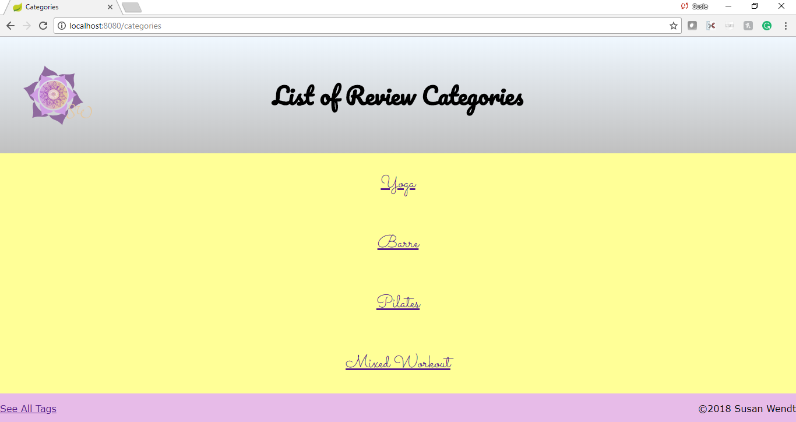

# Reviews Site Full Stack Overview

## Description: 
- Project done at We Can Code IT referencing previous Review Site repository. This is my first full stack and pair programming project. 
- Uses Java, Spring Boot, Spring MVC, Spring Initialzr, JPA, SQL DataBase, as well as Front End languages HTML, and CSS. 
- Reviewing work out studios around the city with descriptions and tags all housed in a database.  

## Tasks
- [X] Add the following dependencies to build.gradle (or use Spring Initializr to create a new build.gradle)
	- [X] JPA (spring-boot-starter-data-jpa)
	- [X] H2

- [X] Create a Category class that:
	- [X] is a JPA entity.
	- [X] contains an instance variable referencing the Reviews it contains.
	- [X] configures an appropriate JPA relationship to its reviews.

- [X] Update the Review class such that:
	- [X] it is a JPA entity.
	- [X] configures a JPA relationship to its associated category.
	- [X] allows for a description/content/body longer than 255 characters.

- [X] Update your view (templates/html/css) such that:
	- [X] there is a page that lists review categories, each of which links to the (details) page for a specific category.
	- [X] there is a page that lists the reviews for a chosen category, each of which links to the (details) page for a specific review.
	- [X] each review detail page has a link to the page for its category.

Stretch Tasks
- [X] Tags
	- [X] Create a Tag entity.
	- [X] Update Review so that it can have tags associated with it. (One review, many tags.)
	- [X] Display tags on the review details page.
	- [X] Create a page that displays links to all of the reviews associated with a given tag.

Stretchier
- [ ] Style your tags list template as a tag cloud, making tags which appear more often larger and/or bolder and those that appear less often smaller and/or lower weight.
- [ ] Allow creation and deletion of tags from a review using <form> and <button> elements along with the appropriate controller method(s).

Rubric

Category|Max Score
---|---
create and wire entity classes with proper annotations | X/5
create necessary repositories | X/5
create needed database with proper annotations | X/10
controller class setup to allow access to necessary templates | X/10
ThymeLeaf templates that accurately display required information | X/10
HTML semantically marked | X/10
CSS style according to convention | X/10
utilize CSS Grid layout according to conventional practice | X/10
utilize FlexBox according to conventional practice | X/10
TDD | X/10
style/formatting/code quality | X/10
**total points**|**X/100**